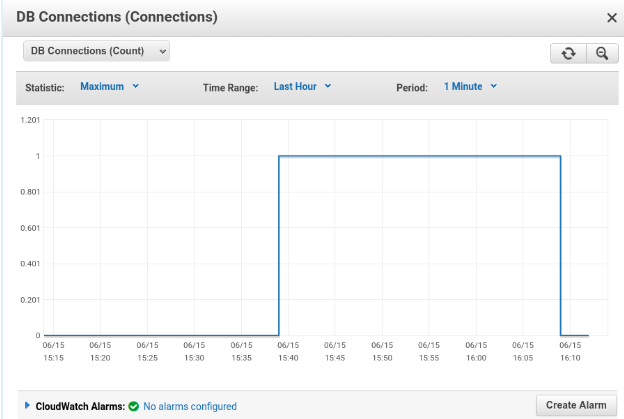

# cljs-rds-backpoller

    bucket=tzjoetest && \
    outfile=$(mktemp) && \
    stack_name=poller && \
    lein clean && \
    lein cljs-lambda build && \
    aws cloudformation package --template-file static/cfn.yaml --s3-bucket $bucket --output-template-file $outfile && \
    aws cloudformation deploy --stack-name ${stack_name} --template-file $outfile --capabilities CAPABILITY_IAM

This does not work as of https://twitter.com/AWSSupport/status/880561732741103620

Was attempting to replicate:

